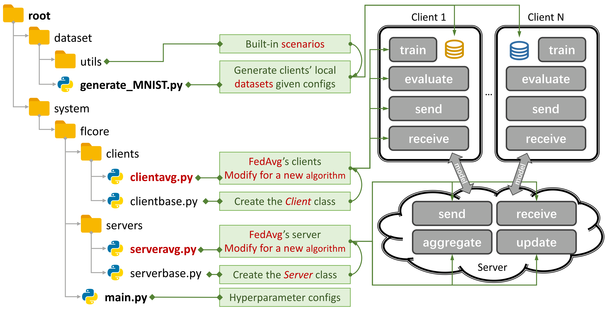

<h1 align="center">
  <i>FedFIP: Fisher-Weighted Aggregation and Prototype Integration for Personalized Federated Learning</i>
</h1>

## :mag: Overview

### 🚀 FedFIP: Bridging Fisher Weighting and Prototype Learning

We propose **FedFIP**, a unified framework that extends **FedAS** by incorporating **class-wise prototype learning** inspired by **Prototype-based learning**.  
FedFIP enables each client to upload compact feature prototypes instead of raw data or full model parameters,  
allowing the server to construct **global semantic centers** that guide subsequent local training.  
This mechanism helps clients learn shared semantic knowledge across domains while retaining personalization.

---

### 🔑 Key Contributions

#### 1️⃣ Fisher-Weighted Global Aggregation  
- 🧠 Leverages **Fisher Information Matrix (FIM)** to evaluate parameter reliability.  
- ⚙️ Aggregates client updates via **softmax-weighted averaging**,  
  allowing global parameters to move toward the most informative gradients.

---

#### 2️⃣ Prototype-Based Semantic Alignment  
- 🌐 Clients compute per-class **feature prototypes** and upload them to the server.  
- 🧩 The server averages same-class prototypes to form **global semantic centers**.  
- 🔄 During local training, clients align their embeddings with these centers,  
  achieving cross-client consistency and enhanced generalization.

---

#### 3️⃣ Personalized Generalization under Non-IID Settings  
- 🪶 Enables each client to benefit from **shared class semantics** without leaking data.  
- ⚖️ Balances **personalized head training** and **global backbone alignment**,  
  ensuring stability across heterogeneous domains.

---

### ✨ Highlights  
- 🔌 **Plug-and-Play**: Compatible with any FedAS-based pipeline.  
- 🧭 **Two-Level Learning**: Combines parameter-level reliability with feature-level semantic alignment.  
- 🔐 **Privacy-Preserving**: Shares only low-dimensional prototypes, not raw samples.  
- 🪶 **Lightweight**: Adds minimal communication overhead (≈0.1% of model size).  

---

## Contents

- [:mag: Overview](#mag-overview)
  - [🚀 FedAS-Stable: A Plug-and-Play PFL Extension](#-fedas-stable-a-plug-and-play-pfl-extension)
  - [🔑 Key Contributions](#-key-contributions)
    - [1️⃣ Adaptive Alignment](#1️⃣-adaptive-alignment)
    - [2️⃣ Robust FIM Weighting](#2️⃣-robust-fim-weighting)
    - [3️⃣ Two-Phase Training Schedule](#3️⃣-two-phase-training-schedule)
  - [✨ Highlights](#-highlights)
- [Contents](#contents)
  - [Getting Started](#getting-started)
        - [Requirements](#requirements)
        - [Installation](#installation)
  - [Deployment](#deployment)
  - [Extend new algorithms and datasets](#extend-new-algorithms-and-datasets)
  - [Author](#author)

### Getting Started

Figure 1: An Example for FedAvg. You can create a scenario using `generate_DATA.py` and run an algorithm using `main.py`, `clientNAME.py`, and `serverNAME.py`. For a new algorithm, you only need to add new features in `clientNAME.py` and `serverNAME.py`.

###### Requirements

- **Operating System**: Ubuntu 24.04.03 LTS (Linux-based)
- **GPU**: NVIDIA GeForce RTX 3060 (or higher, CUDA-enabled)
- **CUDA Toolkit**: 12.x (compatible with your GPU driver)

###### Installation

1. Install Conda (If you have already installed this command or Anaconda , you can skip this step!!!!)

```sh
./install_miniconda.sh
```

### Deployment

1. Create a virtual environment and install the Python libraries

```sh
conda env create -f env.yaml
conda activate PFL
```

2. Generate the dataset based on the data distribution you personally want to test, for example FashionMNIST

**IID**: In this case, the data is evenly and randomly distributed across all clients. Each client receives a representative sample from the entire dataset, meaning the local data distributions closely resemble the global data distribution. For example, with the FashionMNIST dataset, every client holds roughly equal proportions of all 10 labels.

**Pathological non-IID**: In this case, each client only holds a subset of the labels, for example, just 2 out of 10 labels from the FashionMNIST dataset, even though the overall dataset contains all 10 labels. This leads to a highly skewed distribution of data across clients.

**Practical (Dirichlet) non-IID**:  
In this case, clients still have access to samples from all labels, but the data exhibits more realistic and nuanced heterogeneity in how it's distributed or generated. We simulate this using two main strategies:

   - **Label distribution skew**  
     All clients share the same set of labels, but the class frequencies vary significantly across clients. This is typically implemented by sampling client-specific class proportions from a Dirichlet(α) distribution. A smaller α value results in more skewed distributions.
   - **Quantity skew**  
     Clients possess varying numbers of samples. For example, one client may have 10,000 data points, while another may only have 500, simulating real-world differences in data volume.

```sh
cd dataset/

python generate_FashionMNIST.py iid balance - # for iid and balanced scenario

python generate_FashionMNIST.py noniid - pat # for pathological noniid and unbalanced scenario

python generate_FashionMNIST.py noniid - dir # for practical noniid and unbalanced scenario
```

3. Run evaluation

```sh
cd system/

python main.py -data FashionMNIST -m CNN -algo FedAvg -gr 300 -did 0 # using the FashionMNIST dataset, the FedAvg algorithm, and the 4-layer CNN model, communication round 300 and single GPU

python main.py -data MNIST -m CNN -algo FedAvg -gr 300 -did 0

python main.py -data KMNIST -m CNN -algo FedAvg -gr 300 -did 0

python main.py -data Cifar10 -m CNN -algo FedAvg -gr 300 -did 0

python main.py -data MiniImagenet -ncl 64 -m CNN -algo FedAvg -gr 500 -did 0

python main.py -data OxfordPets -ncl 37 -m CNN -algo FedAvg -gr 500 -did 0

python main.py -data OfficeHome -ncl 65 -m CNN -algo FedAvg -gr 500 -did 0

python main.py -data Cifar100 -ncl 100 -m CNN -algo FedAvg -gr 600 -did 0

python main.py -data COIL100 -ncl 100 -m CNN -algo FedAvg -gr 600 -did 0

python main.py -data Food101 -ncl 101 -m CNN -algo FedAvg -gr 600 -did 0

python main.py -data FGVC_Aircraft -ncl 100 -m CNN -algo FedAvg -gr 600 -did 0

python main.py -data Flowers102 -ncl 102 -m CNN -algo FedAvg -gr 600 -did 0

python main.py -data StanfordDogs -ncl 120 -m CNN -algo FedAvg -gr 700 -did 0

python main.py -data TinyImagenet -ncl 200 -m CNN -algo FedAvg -gr 160 -did 0

python main.py -data CUB_200_2011 -ncl 200 -m CNN -algo FedAvg -gr 160 -did 0

python main.py -data FashionMNIST -m CNN -algo FedAvg -gr 300 -did 0,1,2,3 # running on multiple GPUs
```

4. Accuracy and Loss visualization

```sh
python plot_metric.py results1.csv results2.csv --metric test_acc --ema 0.15 --output Result.png

python plot_metric.py results1.csv results2.csv --metric train_loss --ema 0.15 --output Result.png

python plot_bar_chart.py
```

For instance

```sh
python plot_metric.py practical/MNIST/Acc/FedAS.csv practical/MNIST/Acc/FedAvg.csv practical/MNIST/Acc/FedDodm.csv practical/MNIST/Acc/DCPFL.csv practical/MNIST/Acc/FedCPD.csv practical/MNIST/Acc/FedFIP.csv  --metric test_acc --ema 0.15 --output MNIST_Acc.png

python plot_metric.py practical/MNIST/Loss/FedAS.csv practical/MNIST/Loss/FedAvg.csv practical/MNIST/Loss/FedDodm.csv practical/MNIST/Loss/DCPFL.csv practical/MNIST/Loss/FedCPD.csv practical/MNIST/Loss/FedFIP.csv  --metric train_loss --ema 0.15 --output MNIST_Loss.png

```

### Extend new algorithms and datasets

- **New Dataset**: To add a new dataset, simply create a `generate_DATA.py` file in `./dataset` and then write the download code and use the [utils](https://github.com/TsingZ0/PFLlib/tree/master/dataset/utils) as shown in `./dataset/generate_MNIST.py` (you can consider it as a template):
  ```python
  # `generate_DATA.py`
  import necessary pkgs
  from utils import necessary processing funcs

  def generate_dataset(...):
    # download dataset as usual
    # pre-process dataset as usual
    X, y, statistic = separate_data((dataset_content, dataset_label), ...)
    train_data, test_data = split_data(X, y)
    save_file(config_path, train_path, test_path, train_data, test_data, statistic, ...)

  # call the generate_dataset func
  ```
  
- **New Algorithm**: To add a new algorithm, extend the base classes **Server** and **Client**, which are defined in `./system/flcore/servers/serverbase.py` and `./system/flcore/clients/clientbase.py`, respectively.
  - Server
    ```python
    # serverNAME.py
    import necessary pkgs
    from flcore.clients.clientNAME import clientNAME
    from flcore.servers.serverbase import Server

    class NAME(Server):
        def __init__(self, args, times):
            super().__init__(args, times)

            # select slow clients
            self.set_slow_clients()
            self.set_clients(clientAVG)
        def train(self):
            # server scheduling code of your algorithm
    ```
  - Client
    ```python
    # clientNAME.py
    import necessary pkgs
    from flcore.clients.clientbase import Client

    class clientNAME(Client):
        def __init__(self, args, id, train_samples, test_samples, **kwargs):
            super().__init__(args, id, train_samples, test_samples, **kwargs)
            # add specific initialization
        
        def train(self):
            # client training code of your algorithm
    ```
  
- **New Model**: To add a new model, simply include it in `./system/flcore/trainmodel/models.py`.
  
- **New Optimizer**: If you need a new optimizer for training, add it to `./system/flcore/optimizers/fedoptimizer.py`.

### Author

611221201@gms.ndhu.edu.tw

Egor Alekseyevich Morozov
